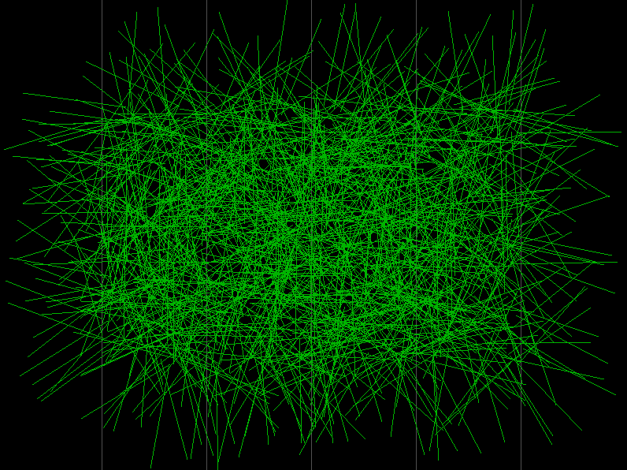

Visualize an estimation of π using a needles' throwing Monte Carlo method.



Make sure to be able to link with Raylib.

```console
$ gnatmake -f -Wall -Wextra buffon_monte_carlo -largs -lm -lraylib
$ ./buffon_monte_carlo
```

# References

- [Buffon's needle problem](https://en.wikipedia.org/wiki/Buffon%27s_needle_problem)
- [https://learn.adacore.com/](https://learn.adacore.com/)
